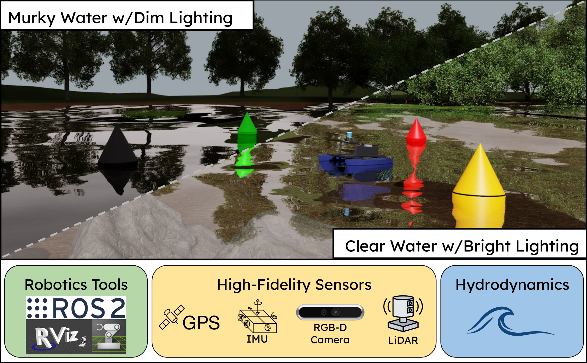

# ASTRA
### ASV Simulator for Transferable Realistic Autonomy



# Dependencies

> ### Ubuntu 22.04

> ### Isaac Sim 5.1.0:

[Installation docs](https://docs.isaacsim.omniverse.nvidia.com/5.1.0/installation/download.html)

> ### ROS 2 Humble

1. Download [Humble Hawksbill](https://docs.ros.org/en/humble/Installation.html)

2. Follow the [Isaac Sim documentation](https://docs.isaacsim.omniverse.nvidia.com/5.1.0/installation/install_ros.html#ros-2-installation) for installing ROS 2

3. After installation, build the Isaac Sim ROS 2 [workspace](https://docs.isaacsim.omniverse.nvidia.com/5.1.0/installation/install_ros.html#setting-up-workspaces)

4. Enable the [ROS 2 Bridge](https://docs.isaacsim.omniverse.nvidia.com/5.1.0/installation/install_ros.html#enabling-the-ros-2-bridge) in Isaac Sim

## Installing ASTRA


Navigate to the user extensions folder in Isaac Sim:

```
cd ~/isaacsim/extsUser/
```

Clone the repository:

```
git clone https://github.com/UMich-CURLY/ASTRA.git
```

Launch Isaac Sim and open the extensions menu (Window -> Extensions). Clear the default filters (@feature) and type in ASTRA. Enable the extension

## Examples

In Isaac Sim, File -> Open. Navigate to the stages folder inside the extension

```
/home/USER/isaacsim/extsUser/ASTRA/assets/stages/
```

Open stage_pond.usd

# Keyboard Control

To control the ASV, the Q (fwd) + A (aft) control the port thrust, and U + J control the starboard thrust.

# Settings

After enabling the extension, a panel will open providing basic settings. To open/close this panel, click ASTRA at the top bar menu -> Settings. More options such as changing boat geometry, propeller strength/location, mass, and individual sensors are available by modifying the code in ASTRA/modules/

# ASTRA_RL

The Isaac Lab extension of this work: https://github.com/UMich-CURLY/ASTRA_RL.
